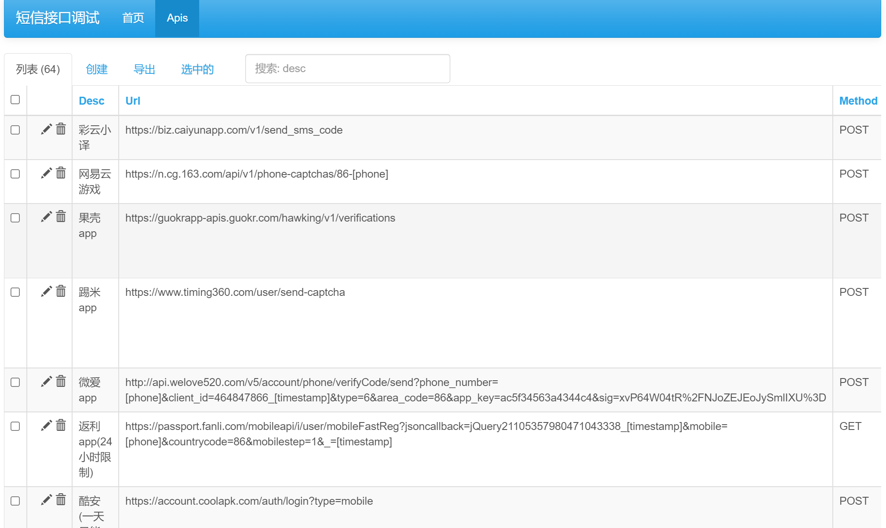
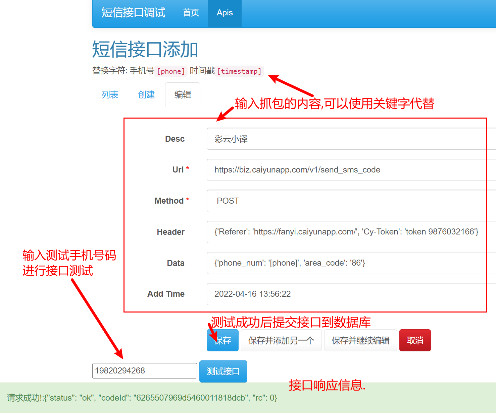

## Disclaimer

1. This program is developed by a **high school art student** ( **15-year-old minor** ), if the user abuses this project, I **do not need to bear** any legal responsibility.
2. This program is for entertainment only, the source code is all open source, **abuse is prohibited** and secondary **selling profit**. **It is prohibited to use for commercial purposes**.
3. I have a history of **depression**, if I suffer any form of cyber violence (including but not limited to sending obscene/obscene/bloody pictures, greeting my family), and **extreme behavior**, everything will be It's **my fault** and it has nothing to do with everyone.

##Features

1. Define the interface by customizing `api.json`.
2. Support keyword replacement. **Timestamp** `[timestamp]` **Phone number** `[phone]`
3. Multi-threaded/asynchronous request.
4. Provide web page testing/adding interface through Flask.
5. Friendly command line parameter support.
6. Use convenient pipenv package management.
7. Call SMS interface through proxy, support http, socks4, socks5 proxy.
8. Use random User-Agent.
9. The number of bombings and the interval between bombings can be specified.

## Quick Start

### For Xiaobai

✨This project has been packaged into an `EXE` executable file using `pyinstaller`! Eliminate the trouble of deploying the Python environment, suitable for Xiaobaibai.

🔨The author's packaging environment is: `Windows 10 x64 Python3.8` If the Windows system is not a **Windows 10 64-bit** version, **may fail to run**! If there is an abnormal error, please take a screenshot and send an Issue.

1. Download the EXE executable
  Please go to the project's [release page](https://github.com/AdminWhaleFall/SMSBoom/releases) to download
  
  > If you cannot download in the domestic network environment, please refer to [https://github.do/](https://github.do/) and other accelerated mirrors.
  
2. Run

   1. Create a new folder in any drive (**except C drive**) and move the program to it. e.g.
   
  
   2. `Win`+`R` to open cmd. Enter the drive letter. For example: `E:` Then cd to the folder, for example `cd SMS`
   
   
   3. After confirming that the cmd path is the path where the EXE is located, enter cmd: `smsboom_pyinstall.exe`, if a command prompt appears, the script is running normally.
   

   4. The latest interface must be updated before use
    ```shell
    smsboom_pyinstall.exe update
    ````
    > If there is an error `ssl_` in the update interface, please refer to [issue](https://github.com/AdminWhaleFall/SMSBoom/issues/2) **Close the agent software** and then update.

   5. [Description of proxy settings](https://github.com/WhaleFell/SMSBoom#%E4%BD%BF%E7%94%A8%E4%BB%A3%E7%90%86), Xiaobai Can not watch for now

   6. Pass parameters, command example:

   Start 64 threads, Boom//Bomb a person's mobile phone number (198xxxxxxxx), only Boom//Bomb once.
   
   ```shell
   smsboom_pyinstall.exe run -t 64 -p 198xxxxxxxxx
   ````

   Start 64 threads, bomb // bomb a person's mobile phone number (19xxxxxxx), start a loop bomb // bomb, take turns bomb // bomb 60 times

   ```shell
   smsboom_pyinstall.exe run -t 64 -p 198xxxxxxxxx -f 60
   ````
   
   Start 64 threads, bomb // bomb a person's mobile phone number (19xxxxxxx), start a loop bomb // bomb, take turns bomb // bomb 60 times, each time interval 30 seconds

   ```shell
   smsboom_pyinstall.exe run -t 64 -p 198xxxxxxxxx -f 60 -i 30
   ````
   
   Start 64 threads, bomb//bomb a person's mobile phone number (19xxxxxxx), start a cycle of bombing//bombing, take turns bombing//bombing 60 times, every 30 seconds, open the proxy list for bombing

   ```shell
   smsboom_pyinstall.exe run -t 64 -p 198xxxxxxxxx -f 60 -i 30 -e
   ````

   Start 64 threads, bomb//bomb multiple people's mobile phone numbers (138xxx, 139xxxx), start a loop bomb//bomb, take turns bombing 60 times, every 30 seconds, open the proxy list for bombing

   ```shell
   smsboom_pyinstall.exe run -t 64 -p 138xxxxxxxx -p 139xxxxxxxx -f 60 -i 30 -e
   ````


### For Big Guys

#### Download project

- Method 1: Using Git:

```shell
git clone https://github.com/AdminWhaleFall/SMSBoom.git/
````

> Wall country acceleration
>
> ```shell
> git clone https://github.do/https://github.com/AdminWhaleFall/SMSBoom.git
> ````

- Method 2: Click to download [project zip package](https://github.com/AdminWhaleFall/SMSBoom/archive/refs/heads/master.zip) and unzip it.

#### Configuration Environment  

**Prerequisites:** Please ensure that your computer has a `python3.x` environment, it is recommended to use `3.8` and above!

Solution 1: If you have a `Python3.8` environment, you can use the `pipenv` tool.

1. Install the pipenv package management tool.
```shell
pip install pipenv
````

2. Build a virtual environment for the project.
```shell
pipenv install # only use bomb// bomb function
pipenv install --dev # Use the webui debug interface function.
````

3. Try running smsboom.py
```shell
pipenv shell # activate the virtual environment
python smsboom.py # linux
````

If no error is reported and help information is output, the environment has been installed correctly. If an error is reported, please use option 2

Option 2: Only the `Python3.X` environment needs to use the native `pip` tool.

1. Install the required libraries
```shell
pip install -r requirements.txt # only use bomb // bomb
pip install -r requirements-dev.txt # use webui
````

2. Try running smsboom.py
```shell
python smsboom.py
````

If no error is reported and help information is output, the environment has been installed correctly.

#### Running with Docker

**Prerequisites:** Please make sure the current environment has [Docker](https://docs.docker.com/get-docker/).

1. Build the image

```shell
docker build -t whalefell/smsboom .
````

2. Try to run

```shell
docker run --rm whalefell/smsboom:latest --help

Usage: smsboom.py [OPTIONS] COMMAND [ARGS]...

Options:
  --help Show this message and exit.

Commands:
  asyncrun requests the interface in the fastest way (true asynchronous million concurrency)
  onerun single thread (for testing)
  run incoming thread number and mobile phone number to start bombing, support multiple mobile phone numbers
  update Get the latest interface from github
````

#### run

If using a virtual environment, please activate it first. `pipenv shell`

```shell
# output help information
python smsboom.py --help

Usage: smsboom.py [OPTIONS] COMMAND [ARGS]...
Options:
--help Show this message and exit.
Commands:
run incoming thread number and mobile phone number to start bombing//exploding, support multiple mobile phone numbers
update Get the latest interface from github
````
- start bombing//exploding

help information:
```shell
python smsboom.py run --help

Usage: smsboom.py run [OPTIONS]

Incoming the number of threads and mobile phone number to start bombing//exploding, support for multiple mobile phone numbers

Options:
-t, --thread INTEGER number of threads (default 64)
-p, --phone TEXT phone number, you can pass in multiple and then use -p to pass [required]
-f, --frequency INTEGER execution times (default 1)
-i, --interval INTEGER interval time (default 60s)
-e, --enable_proxy BOOLEAN enable proxy (default disabled)
--help Show this message and exit.
````

### Using a proxy

This project cannot automatically obtain a proxy through the API. You can manually obtain a proxy from the free proxy website below, or choose to use your own proxy, or not use a proxy.

> [https://proxyscrape.com/free-proxy-list](https://proxyscrape.com/free-proxy-list)

> [https://openproxy.space/list](https://openproxy.space/list)

Add the proxy to the three files `http_proxy.txt` `socks4_proxy.txt` `socks5_proxy.txt`, add `-e` to the command parameter to execute.

### Command example
Start 64 threads, bomb//bomb a person's mobile phone number (198xxxxxxxx), and only bomb//bomb one wave.

```shell
python smsboom.py run -t 64 -p 198xxxxxxxx
```
Start 64 threads, bomb // bomb a person's mobile phone number (198xxxxxxxx), start a loop bomb // bomb, take turns bomb // bomb 60 times

```shell
python smsboom.py run -t 64 -p 198xxxxxxxx -f 60
```Start 64 threads, bomb // bomb a person's mobile phone number (198xxxxxxxx), start a loop bomb // bomb, take turns bomb // bomb 60 times, each time interval 30 seconds

```shell
python smsboom.py run -t 64 -p 198xxxxxxxx -f 60 -i 30
```Start 64 threads, bomb//bomb a person's mobile phone number (198xxxxxxxx), start a loop of bomb//bomb, take turns to bomb//bomb 60 times, every 30 seconds, open the proxy list to bomb

```shell
python smsboom.py run -t 64 -p 198xxxxxxxx -f 60 -i 30 -e
```
Start 64 threads, bomb//bomb multiple people's mobile phone numbers (198xxxxxxxx, 199xxxxxxxx), start a loop bomb//bomb, take turns bombing 60 times, every 30 seconds, open the proxy list for bombing

```shell
python smsboom.py run -t 64 -p 198xxxxxxxx -p 199xxxxxxxx -f 60 -i 30 -e
```

## Development

The program provides interface debugging tools, but it is not perfect at present. Front-end big guys are welcome to PR.
The debugging tool uses `Flask` as the backend and `vue` as the frontend to realize the separation of front and back ends.
At present, there is only a test interface, adding the function of the interface.

### Flask front-end debugging

> **The premise is that the pipenv environment has been installed according to the previous Quick Start method**

```shell
pipenv shell # Activate the virtual environment
python run_flask_app.py start -p 9090 # Listen on port 9090
```

**run help:**
```shell
Usage: run_flask_app.py [OPTIONS] COMMAND [ARGS]...

Options:
  --help  Show this message and exit.

Commands:
  init         Initialize the database
  json2sqlite  Convert json data to sqlite database
  sqlite2json  Convert sqlite data to json
  start        start flask app
```

```shell
Usage: run_flask_app.py start [OPTIONS]

  start up flask app

Options:
  -h, --host TEXT     listen address
  -p, --port INTEGER  listening port
  --help              Show this message and exit.
```
The default monitoring *0.0.0.0:9090* address, the browser access [http://127.0.0.1:9090/admin/] (http://127.0.0.1:9090/admin/) If there is no accident, the front end can appear Debug interface.




## Sponsor
[Love Power Generation 🔗](https://afdian.net/@smsboom)


<!-- **WeChat/Chat && Pay/Alipay🔗**
<center class="half">


</center> -->

> The sponsored amount will be used for my monthly treatment of **depression/depression**. Thank you all for your support and encouragement! **Biaxin**

<center class="half">
  According to relevant Chinese laws and regulations, this picture is not allowed to be displayed.

</center>

> ~~Ugly Selfie )Escape~~

## Star ♥ Trend


## ✨Discussion

Feel free to join the discussion and ask questions and suggestions about the project! ! ! mua!

### Penguin 🐧 Group
> The penguin group is not allowed to discuss related sensitive information! Violators get on the plane ticket✈


### Telegram Channel (TG group)
> For topics related to sensitive/sensitive information, politics/politics, democracy/democracy movement, please go to **TG group chat**

[SMSBoomPro](https://t.me/SMSBoomPro)
